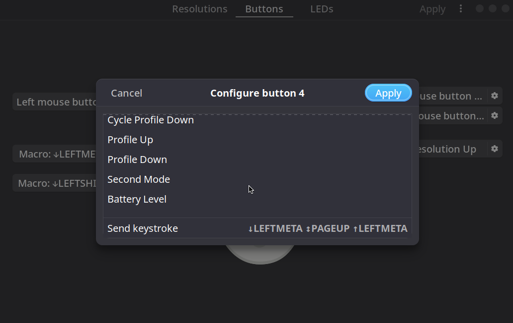
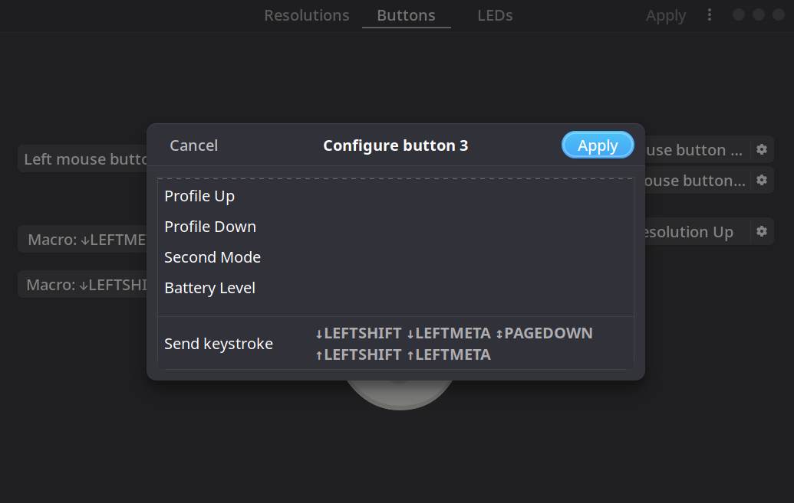

# Arch Linux 上如何使用 piper 设置鼠标按键

* libratbag: 提供了ratbagd（DBus守护程序）来配置输入设备，主要是游戏鼠标。
* piper: Piper是一个GTK +应用程序，用于配置游戏鼠标。 Piper 只是 Ratbagd DBus守护程序的图形前端，所以要使 piper 正常工作我门需要先安装 libratbag，并且启用相关服务。

1. 安装libratbag

```bash
sudo pacman -S libratbag
```

2. 开启相关服务并设为开机自启

```bash
sudo ratbagd
sudo systemctl daemon-reload
sudo systemctl reload dbus.service
sudo systemctl enable ratbagd.service
```

3. 安装 piper

```bash
sudo pacman -S piper
```

4. 打开 piper，使用 GUI 进行配置即可

 