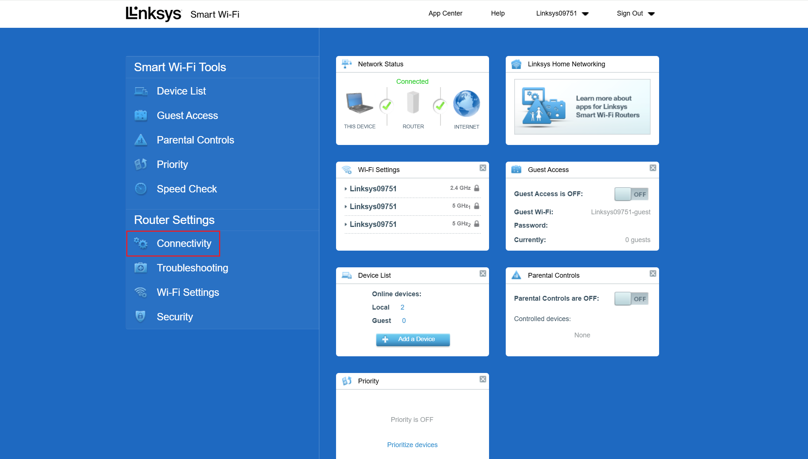

Installation instructions
1. Open Linksys Web UI - http://192.168.1.1/ or http://10.65.1.1/ depending on your setup.

2. Login with your admin password. The default password can be found on a sticker under the device.

3. To enter into the support mode, click on the “CA” link and the bottom of the page.


4. Open the “Connectivity” menu and upload the squash-factory.bin image with the “Choose file” button. If there's no button, go to the hidden manual upgrade page - https://192.168.1.1/fwupdate.html, bypass the encryption error if necessary, select your OpenWrt firmware file, enter your router password and click “Update”.




5. Click start. Ignore all the prompts and warnings by click “yes” in all the popups.


6. The Wifi radios are turned off by default. To configure the router, you will need to connect your computer to the LAN port of the device.

7. Then you would need to write openwrt to the other partition for it to work

8. First Check booted partition

```bash
C:\Users\Innovation>ssh root@192.168.1.1


BusyBox v1.36.1 (2025-04-13 16:38:32 UTC) built-in shell (ash)

  _______                     ________        __
 |       |.-----.-----.-----.|  |  |  |.----.|  |_
 |   -   ||  _  |  -__|     ||  |  |  ||   _||   _|
 |_______||   __|_____|__|__||________||__|  |____|
          |__| W I R E L E S S   F R E E D O M
 -----------------------------------------------------
 OpenWrt 24.10.1, r28597-0425664679
 -----------------------------------------------------
=== WARNING! =====================================
There is no root password defined on this device!
Use the "passwd" command to set up a new password
in order to prevent unauthorized SSH logins.
--------------------------------------------------
root@OpenWrt:~# cat /proc/mtd
dev:    size   erasesize  name
mtd0: 00100000 00040000 "0:sbl1"
mtd1: 00100000 00040000 "0:mibib"
mtd2: 00080000 00040000 "0:bootconfig"
mtd3: 00080000 00040000 "0:bootconfig1"
mtd4: 00300000 00040000 "0:qsee"
mtd5: 00300000 00040000 "0:qsee_1"
mtd6: 00080000 00040000 "0:devcfg"
mtd7: 00080000 00040000 "0:devcfg_1"
mtd8: 00080000 00040000 "0:apdp"
mtd9: 00080000 00040000 "0:apdp_1"
mtd10: 00080000 00040000 "0:rpm"
mtd11: 00080000 00040000 "0:rpm_1"
mtd12: 00080000 00040000 "0:cdt"
mtd13: 00080000 00040000 "0:cdt_1"
mtd14: 00080000 00040000 "0:appsblenv"
mtd15: 00100000 00040000 "0:appsbl"
mtd16: 00100000 00040000 "0:appsbl_1"
mtd17: 00080000 00040000 "0:art"
mtd18: 00100000 00040000 "u_env"
mtd19: 00100000 00040000 "s_env"
mtd20: 00040000 00040000 "devinfo"
mtd21: 0af40000 00040000 "kernel"
mtd22: 0a740000 00040000 "rootfs"
mtd23: 0af40000 00040000 "alt_kernel"
mtd24: 0a740000 00040000 "alt_rootfs"
mtd25: 00400000 00040000 "sysdiag"
mtd26: 00080000 00040000 "0:ethphyfw"
mtd27: 079c0000 00040000 "syscfg"
mtd28: 00400000 00040000 "secured_store"
mtd29: 01900000 00040000 "0:wififw"
mtd30: 16180000 00040000 "app2_data"
mtd31: 09280000 00040000 "app2"
root@OpenWrt:~# fw_printenv -n boot_part
1
```

9. Then install Openwrt to the other partition if booted in slot 1:

```bash
cd /tmp/
wget https://quicapp.uk/d/openwrt-24.10.1-qualcommax-ipq807x-linksys_mx4300-squashfs-factory.bin

mtd -r -e alt_kernel -n write openwrt-24.10.1-qualcommax-ipq807x-linksys_mx4300-squashfs-factory.bin alt_kernel

sysupgrade -v -F -n /tmp/openwrt-24.10.1-qualcommax-ipq807x-linksys_mx4300-squashfs-sysupgrade.bin
```

<!-- **If** in slot 2:

```bash
mtd -r -e kernel -n write openwrt-qualcommax-ipq807x-linksys_mx4300-squashfs-factory.bin kernel
``` -->

---

Password: `Xf@wb1S@jV`

Customize installed packages and/or first boot script
Installed Packages

`luci-theme-material`

Script to run on first boot (uci-defaults)

```bash
uci set wireless.@wifi-device[0].disabled='0'
uci set wireless.@wifi-device[0].cell_density='0'
uci set wireless.@wifi-iface[0].disabled='0'
uci set wireless.@wifi-iface[0].ssid='OpenWrt4300'
uci set wireless.@wifi-iface[0].encryption='sae-mixed'
uci set wireless.@wifi-iface[0].key='HelloWorld'
uci commit wireless
```

---

```bash
opkg update
opkg install luci-theme-material
```

## Reference

* [qualcommax: ipq807x: add support for Linksys MX4300 (LN1301)](https://github.com/openwrt/openwrt/pull/16070)