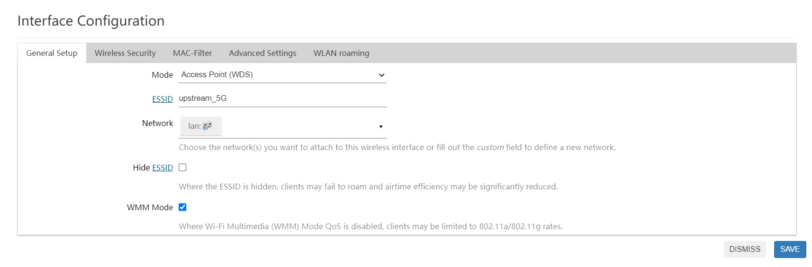
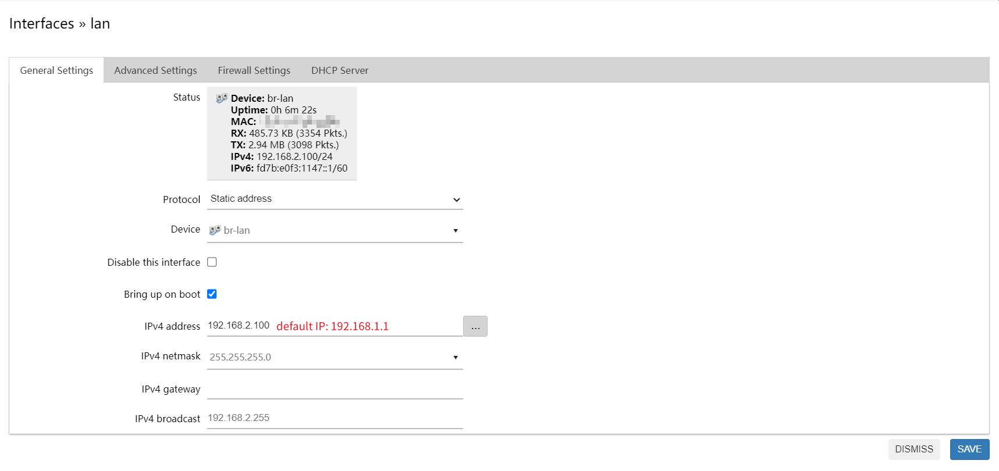
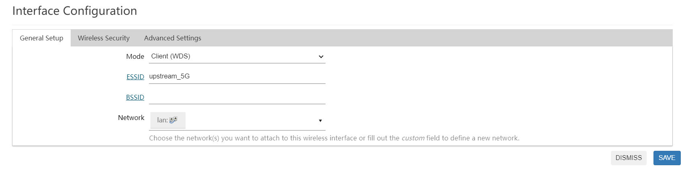
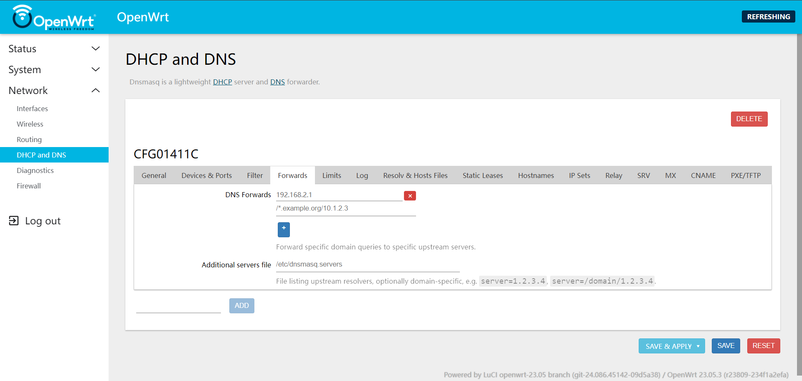
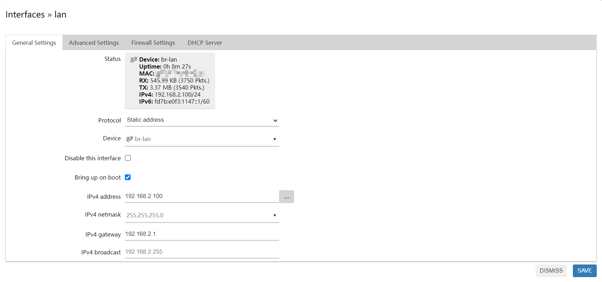
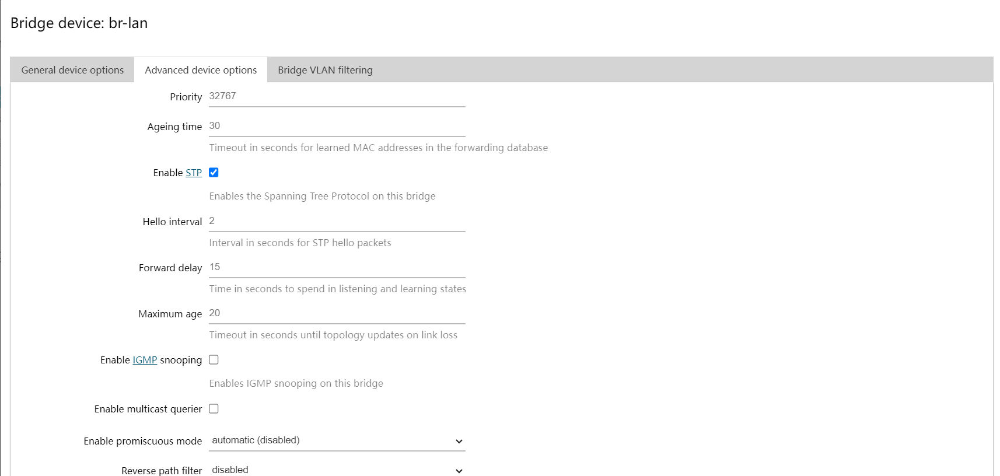

## The upstream

* LAN IP: `192.168.2.1`

LuCI homepage → Network → Wireless

Just set the wireless mode to "Access Point (WDS)"

## The repeater

* LAN IP: `192.168.1.1`

LuCI homepage → Network → Interfaces → **Edit** the `lan` interface

> On the LAN network interface of the repeater, change the default IP to a different one from the same subnet of upstream such as `192.168.2.100`. Save & Apply the change.

---

LuCI homepage → Network → Interfaces → **Edit** the `lan` interface → DHCP Server →

- [x] Ignore interface

> Reconnect to the repeater at its new LAN IP address, and disable the DHCP server. Save & Apply the change.

---

LuCI homepage → Network → Wireless → **SCAN** → JOIN NETWORK → fill the WPA passphrase of upstream wireless & set the `Create / Assign firewall-zone` to `lan`

> For a wireless interface working on the same frequency band as the **upstream** access point, click **Scan**, join the previously created upstream wireless network and when asked, set the firewall zone to `lan`.

The wireless mode should be `Client (WDS)` and the **Network** in **Interface Configuration** has to be changed from `wwan` to `lan`. Save & Apply the change.

Reconnet the wireless of the repeater and set your PC to static IP address:  `192.168.2.3`, netmask: `255.255.255.0`, gateway: `192.168.2.100`

LuCI homepage → Network → DHCP and DNS → CFG01411C → Forwards → DNS Forwards: `192.168.2.1`

> Go to **Network**, **DHCP and DNS**. Set `DNS forwardings` to the IP address of the access point. Save & Apply the change.

LuCI homepage → Network → Interfaces → **Edit** the `lan` interface → IPv4 gateway: `192.168.2.1`

> Go to **Network**, **Interfaces**, **Lan**, **Edit**. Set `IPv4 gateway` to the IP address of the access point. Save & Apply the change.

LuCI homepage → Network → Interfaces → Devices → **Configure...** on `br-lan` → **Advanced device options** →

- [x] Enable STP

> Go to **Network**, **Interfaces**, **Devices** tab, **Configure...** on br-lan, **Advanced device options** and enable `STP`. Failing to do so can allow a network loop to form that will take down all routers. Save & Apply the change.

Finally, add a new Wi-Fi network if you want to enable wireless access to the network. It can have the same name (SSID), password and settings than the access point, to allow transparent roaming, or they can be different. When creating the new Wi-Fi network, under **General Setup**, ensure that **Mode** is `Access Point` and **Network** is set to `lan`.

